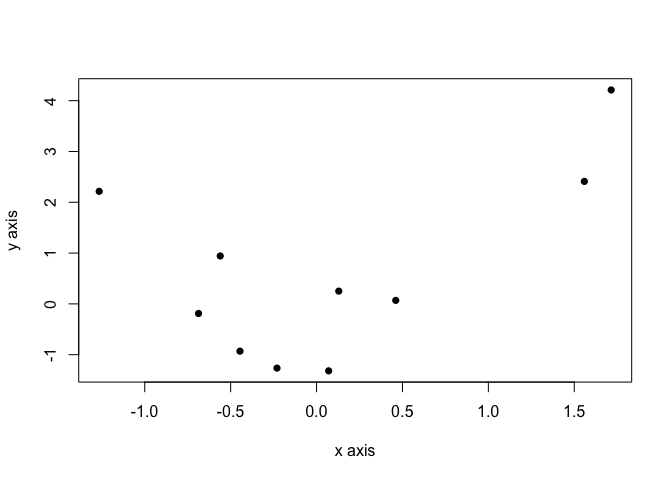
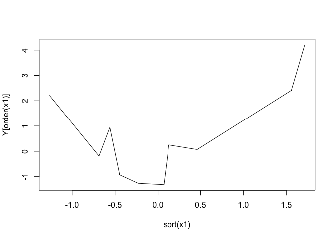
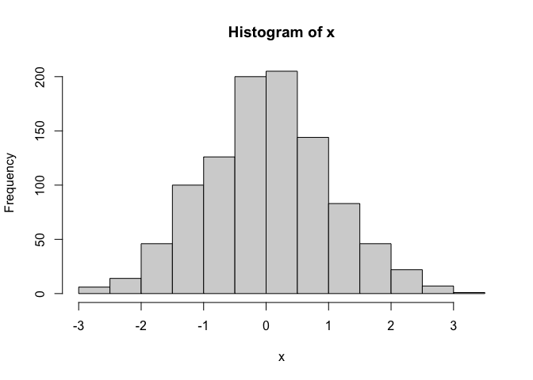
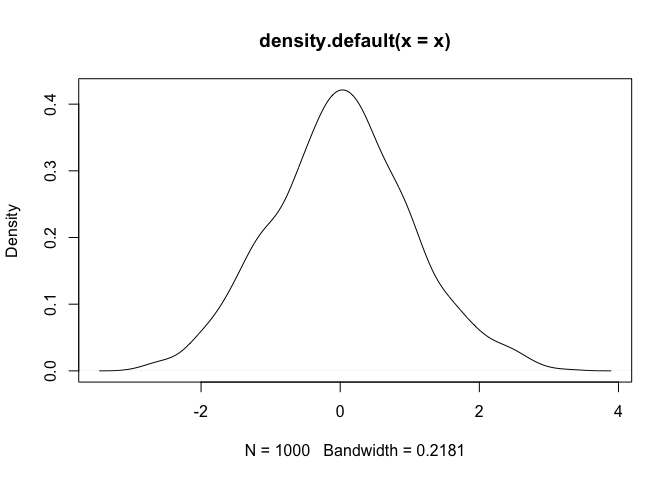

R Review (ECON/POLISCI 151)
================

## Basics

Recommended IDE is [RStudio](https://www.rstudio.com/products/rstudio/)

Useful file types:

-   R script: Basic file containing only code (and comments)
-   Markdown files: Mix of text and code (e.g., this file was made using
    markdown)
    -   Code from other languages besides R
    -   Multiple output options: HTML, pdf, etc.
    -   Include LaTeX code for math:
        =c^kf(x)")

## Packages

Install packages from CRAN:

``` r
## Comment out code using '#'
#install.packages("PackageName")
```

Attach packages:

``` r
#require(PackageName)
# or, equivalently,
#library(PackageName)
```

Can use functions from an installed package without attaching it (also a
good way to specify package):

``` r
#PackageName::function()
#DifferentPackage::function()
```

Install packages from github:

``` r
#devtools::install_github("DeveloperName/PackageName")
```

## Objects and data types

Instantiate new objects:

``` r
a1 <- 1
print(a1)
```

    ## [1] 1

``` r
a1  # can omit "print()"
```

    ## [1] 1

``` r
# can include multiple commands on one line by separating with ";"
a2 = 2; print(a2)
```

    ## [1] 2

### Logicals/booleans:

``` r
typeof(TRUE)
```

    ## [1] "logical"

``` r
T  # TRUE
```

    ## [1] TRUE

``` r
# checking (in)equality
1 == 1
```

    ## [1] TRUE

``` r
1 != 1
```

    ## [1] FALSE

``` r
1 <= 1
```

    ## [1] TRUE

``` r
1 > 1
```

    ## [1] FALSE

``` r
# can treat as a number
1+TRUE
```

    ## [1] 2

``` r
1+FALSE
```

    ## [1] 1

### Numbers

``` r
typeof(1)
```

    ## [1] "double"

``` r
typeof(1L)
```

    ## [1] "integer"

``` r
typeof(as.integer(1))
```

    ## [1] "integer"

``` r
# "is.integer()" does not check for whole numbers
is.integer(1)
```

    ## [1] FALSE

Vectors:

``` r
v1 <- c(1,2,3); v1
```

    ## [1] 1 2 3

``` r
v2 <- 1:3; v2
```

    ## [1] 1 2 3

``` r
# different data types
typeof(v1); typeof(v2)
```

    ## [1] "double"

    ## [1] "integer"

``` r
# sequence, with step size other than 1
seq(from=1, to=10, by=3)
```

    ## [1]  1  4  7 10

Matrices:

``` r
## white space does not delimit code; use it for readability
# bad:
mat <- rbind(1:3,           4:6,
             
             
        7:9)

# better:
mat <- rbind(1:3,
             4:6,
             7:9)
mat
```

    ##      [,1] [,2] [,3]
    ## [1,]    1    2    3
    ## [2,]    4    5    6
    ## [3,]    7    8    9

``` r
typeof(mat)
```

    ## [1] "integer"

``` r
matrix(1:9, nrow=3, byrow = T)
```

    ##      [,1] [,2] [,3]
    ## [1,]    1    2    3
    ## [2,]    4    5    6
    ## [3,]    7    8    9

``` r
# Matrix operations:
t(mat)  # transpose
```

    ##      [,1] [,2] [,3]
    ## [1,]    1    4    7
    ## [2,]    2    5    8
    ## [3,]    3    6    9

``` r
mat * 2  # elementwise multiplication
```

    ##      [,1] [,2] [,3]
    ## [1,]    2    4    6
    ## [2,]    8   10   12
    ## [3,]   14   16   18

``` r
mat * mat  
```

    ##      [,1] [,2] [,3]
    ## [1,]    1    4    9
    ## [2,]   16   25   36
    ## [3,]   49   64   81

``` r
mat %*% mat  # matrix multiplication
```

    ##      [,1] [,2] [,3]
    ## [1,]   30   36   42
    ## [2,]   66   81   96
    ## [3,]  102  126  150

``` r
mat + mat
```

    ##      [,1] [,2] [,3]
    ## [1,]    2    4    6
    ## [2,]    8   10   12
    ## [3,]   14   16   18

``` r
mat + 1
```

    ##      [,1] [,2] [,3]
    ## [1,]    2    3    4
    ## [2,]    5    6    7
    ## [3,]    8    9   10

### Characters/strings

``` r
s1 <- "this is a string"; cat(s1)
```

    ## this is a string

``` r
typeof(s1)
```

    ## [1] "character"

``` r
# some special symbols need to be escaped:
cat("s \ ")
```

    ## s

``` r
cat("s \\ ")
```

    ## s \

### Factors

Discrete variables

``` r
f1 <- factor(1:3)
# can specify order
f2 <- factor(1:3, levels=c(2, 1, 3))
sort(f1)
```

    ## [1] 1 2 3
    ## Levels: 1 2 3

``` r
sort(f2)
```

    ## [1] 2 1 3
    ## Levels: 2 1 3

### Dataframes

``` r
# can accomodate multiple data types
df <- cbind.data.frame(numbers=1:3, words=c("1", "2", "3"))
df
```

    ##   numbers words
    ## 1       1     1
    ## 2       2     2
    ## 3       3     3

``` r
# if we try to do the same with matrices:
cbind(numbers=1:3, words=c("1", "2", "3"))
```

    ##      numbers words
    ## [1,] "1"     "1"  
    ## [2,] "2"     "2"  
    ## [3,] "3"     "3"

### Lists

``` r
# can store basically any data together in one object
list("a", 1, lm(1~1))
```

    ## [[1]]
    ## [1] "a"
    ## 
    ## [[2]]
    ## [1] 1
    ## 
    ## [[3]]
    ## 
    ## Call:
    ## lm(formula = 1 ~ 1)
    ## 
    ## Coefficients:
    ## (Intercept)  
    ##           1

## Manipulating data

Subsetting my location:

``` r
df[1, 1]  # element in row 1, column 1
```

    ## [1] 1

``` r
df[1, ]  # entire first row
```

    ##   numbers words
    ## 1       1     1

``` r
df[, 1]  # entire first column
```

    ## [1] 1 2 3

By name:

``` r
df[, "numbers"]
```

    ## [1] 1 2 3

``` r
df$numbers
```

    ## [1] 1 2 3

``` r
df[["numbers"]]
```

    ## [1] 1 2 3

Appending data:

``` r
df$new_column1 <- df$numbers+1
df
```

    ##   numbers words new_column1
    ## 1       1     1           2
    ## 2       2     2           3
    ## 3       3     3           4

Useful package:

``` r
require(dplyr)  # also tidyr
```

    ## Loading required package: dplyr

    ## 
    ## Attaching package: 'dplyr'

    ## The following objects are masked from 'package:stats':
    ## 
    ##     filter, lag

    ## The following objects are masked from 'package:base':
    ## 
    ##     intersect, setdiff, setequal, union

``` r
df %>% mutate(new_column2 = (numbers <= 2) )
```

    ##   numbers words new_column1 new_column2
    ## 1       1     1           2        TRUE
    ## 2       2     2           3        TRUE
    ## 3       3     3           4       FALSE

## Random variables and probability distributions

Generate random numbers:

``` r
set.seed(123)  # set seed to ensure reproducibility
runif(n=3, min=0, max=1) # uniform(0, 1)
```

    ## [1] 0.2875775 0.7883051 0.4089769

``` r
rnorm(n=3, mean=0, sd=1) # normal(0, 1)
```

    ## [1]  1.190207 -1.689556  1.239496

Quantiles of a distribution:

``` r
qnorm(.025, mean=0, sd=1)  # 2.5th quantile of N(0,1)
```

    ## [1] -1.959964

CDF:

``` r
pnorm(0, mean=0, sd=1) # F(0) = P( N(0,1) < 0 )
```

    ## [1] 0.5

PDF:

``` r
dnorm(0, 0, 1) # f(0)
```

    ## [1] 0.3989423

## Regression

``` r
set.seed(123)
x1 <- rnorm(n=10)
x2 <- rnorm(n=10)

Y <- x1 + 2*x2 + rnorm(n=10)

out <- lm(Y ~ x1 + x2)
out$residuals  # model has many things you can extract
```

    ##          1          2          3          4          5          6          7 
    ## -0.2612187  0.2393729 -0.3453045 -0.3486716 -0.5366225 -0.3672157  1.4361617 
    ##          8          9         10 
    ## -0.5498960 -0.5801461  1.3135405

``` r
summary(out)
```

    ## 
    ## Call:
    ## lm(formula = Y ~ x1 + x2)
    ## 
    ## Residuals:
    ##     Min      1Q  Median      3Q     Max 
    ## -0.5802 -0.4943 -0.3470  0.1142  1.4362 
    ## 
    ## Coefficients:
    ##             Estimate Std. Error t value Pr(>|t|)   
    ## (Intercept)  -0.3226     0.2794  -1.155  0.28611   
    ## x1            0.8854     0.3696   2.396  0.04776 * 
    ## x2            1.5521     0.3396   4.571  0.00257 **
    ## ---
    ## Signif. codes:  0 '***' 0.001 '**' 0.01 '*' 0.05 '.' 0.1 ' ' 1
    ## 
    ## Residual standard error: 0.8632 on 7 degrees of freedom
    ## Multiple R-squared:  0.8939, Adjusted R-squared:  0.8635 
    ## F-statistic: 29.48 on 2 and 7 DF,  p-value: 0.0003895

``` r
coef(out)
```

    ## (Intercept)          x1          x2 
    ##  -0.3225640   0.8853996   1.5520955

``` r
confint(out)
```

    ##                   2.5 %    97.5 %
    ## (Intercept) -0.98312436 0.3379963
    ## x1           0.01150657 1.7592926
    ## x2           0.74916076 2.3550303

``` r
# data can also be dataframe
df <- cbind.data.frame(Y, Var1=x1, Var2=x2)
head(df)
```

    ##            Y        Var1       Var2
    ## 1  0.8198642 -0.56047565  1.2240818
    ## 2  0.2714752 -0.23017749  0.3598138
    ## 3  1.3342468  1.55870831  0.4007715
    ## 4 -0.4370174  0.07050839  0.1106827
    ## 5 -1.6074338  0.12928774 -0.5558411
    ## 6  3.6021979  1.71506499  1.7869131

``` r
fm <- formula(Y~Var1+Var2)
lm(fm, data=df)
```

    ## 
    ## Call:
    ## lm(formula = fm, data = df)
    ## 
    ## Coefficients:
    ## (Intercept)         Var1         Var2  
    ##     -0.3226       0.8854       1.5521

``` r
lm(Y~., data=df)  # regress Y on all other variables in df
```

    ## 
    ## Call:
    ## lm(formula = Y ~ ., data = df)
    ## 
    ## Coefficients:
    ## (Intercept)         Var1         Var2  
    ##     -0.3226       0.8854       1.5521

``` r
# can transform data
Y <- x1^2 + log(abs(x2)) + rnorm(n=10)
lm(Y ~ Var1^2 + log(abs(Var2)), data=df)
```

    ## 
    ## Call:
    ## lm(formula = Y ~ Var1^2 + log(abs(Var2)), data = df)
    ## 
    ## Coefficients:
    ##    (Intercept)            Var1  log(abs(Var2))  
    ##       -0.09783         1.85627        -0.05252

``` r
# many other functions take the same formula
df$Y <- rbinom(n=10, size=1, prob=.5)  # binary outcome
glm(fm, data=df, family = binomial(link=probit))  # probit 
```

    ## 
    ## Call:  glm(formula = fm, family = binomial(link = probit), data = df)
    ## 
    ## Coefficients:
    ## (Intercept)         Var1         Var2  
    ##     0.03340     -0.73792     -0.07593  
    ## 
    ## Degrees of Freedom: 9 Total (i.e. Null);  7 Residual
    ## Null Deviance:       13.86 
    ## Residual Deviance: 11.57     AIC: 17.57

## Plots

Dot plot:

``` r
plot(x=x1, y=Y, pch=16,
     xlab="x axis", ylab="y axis")
```

<!-- -->

Line

``` r
plot(x=sort(x1), y=Y[order(x1)], type = "l")
```

<!-- -->

Histogram and density

``` r
x <- rnorm(1000)
hist(x)
```

<!-- -->

``` r
plot(density(x))
```

<!-- -->
