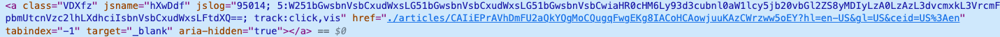

```{r setup, include=FALSE}
knitr::opts_chunk$set(echo = TRUE)

require(magrittr)
```

## A Brief Primer on HTML
HyperText Markup Language (HTML) is a markup language (similar to LaTeX) and is what most websites are written in. An html document is essentially a tree composed of nodes. Nodes can be text, links, tables, etc., and they themselves can have "descendant" nodes (e.g., a table is itself a node, but inside the table there might be something that makes text italics, and then inside that will be the text itself).

For our purposes, there are a few important terms to introduce. First, and _element_ is a type of node that makes up the document, and it can be used for many different purposes. An element is delimited at the front and the end with a _tag_. Below is an example of an element:

    <a> text here </a>

The <tt>`<p>`</tt> at the beginning and the <tt>`</p>`</tt> at the end are tags. 

Elements can also have _attributes_, which are specified inside the opening tag. For example, we might want our element to be a certain color. We can do this using the <tt>style</tt> attribute:

    <a style="color:#53565A"> text here </a>.

## General Websites
To do webscrapping in R, we will be using the <tt>rvest</tt> package (a part of <tt>tidyverse</tt>). <tt>rvest</tt> is designed to go with <tt>magrittr</tt> package; you don't need to use the latter, but taking advantage of the pipe <tt>%>%</tt> operator will make your code a lot less verbose. 

We will use a CNN page on the war in Ukraine as an example. First, we need to use the <tt>read_html</tt> function to read the html document (the function returns an xml file, a format which <tt>rvest</tt>'s other functions will need).

```{r}
cnn_url <- "https://www.cnn.com/europe/live-news/ukraine-russia-putin-news-04-3-22/h_4d0118cfd6f30770be0f8f54e041f9d2"
cnn_page <- cnn_url %>% rvest::read_html() # read_html is actually from xml2, which rvest imports 
```

There are many types of data you might want from a webpage, and each will require a different method of extraction. In this case, we're looking at an article and most likely will want the contents of that article. As a starting point, we might want to look at text that is sandwiched by p tags,

    <p> text here </p>.

```{r}
cnn_text <- cnn_page %>%
  rvest::html_elements("p") %>%  # elements delimited by the p tag
  rvest::html_text()  # text inside the tag
head(cnn_text)
```

This gives us a vector of all the text in each of the paragraph elements on the webpage. 

(Alternatively, you can look try other tags, like "body" -- just note that using a different tag will also mean the output is formated differently (and all the paragraphs will be smooshed together).)

Another example is images: Perhaps we are interested in seeing what types of images news organizations with different political leanings tend to use when covering a given subject (e.g., are more right-leaning news organizations more likely to include pictures of violence or then destruction of property when reporting on BLM?). To do this, we will retrieve the <tt>src</tt> attribute of the <tt>img</tt> element.

```{r}
cnn_img <- cnn_page %>% 
  rvest::html_elements("img") %>%  # img elements
  rvest::html_attr("src")  # the src attribute
```


This gives us links to the images, which we can then feed to whatever learner (or human coder) we want. Maybe we also want to store the captions for these photos:

```{r}
cnn_cap <- cnn_page %>% rvest::html_elements("figcaption") %>% rvest::html_text()
cnn_img_df <- cbind(image = cnn_img, caption = cnn_cap)
cnn_img_df[1:2, ]  # first two examples
```

What you do with this information is a whole 'nother story. We will learn a bit about how to use text as data in a future section, but computer vision is beyond the scope of this class. 

There is, however, one concern that we can address now: What if we can't/don't want to collect the url of potentially thousands of websites? In some circumstances, there will be websites that aggregate other websites, and we can scrape urls from such aggregators. In this case, we can use Google News, which aggregates links to news articles.

## Aggregation Websites: e.g., Google News
This section will walk you through the process of scraping Google News for articles on a specific topic. We will use "ukraine" as the example, but this will work for any search term(s). This is because Google News uses a fixed url format that varies only in the search term, which makes it easy for us to write flexible code. To see what this url is, you can just go to the Google News page and search for something. The url will have a field beggining with <tt>q</tt> (for query), followed by whatever you search for. (This doesn't just have to be a set of words; you can look up Google url search parameters to see how else you can narrow your search. For the purposes of this demonstration, though, let's keep it simple.)
```{r}
## Get the search result page
term <- "ukraine"
url <- paste0("https://news.google.com/search?q=", term, 
              "&hl=en-US&gl=US&ceid=US%3Aen")
html_doc <- rvest::read_html(url)
```

We want to get the html node that links to the article. To do so, we open Google News and use Chrome's inspection tool under <tt>View > Developer > Inspect Elements</tt> tool.

{#id .class width=50% height=50%}

The node we want is called "VDXfz", and we want to extract the hyperlink from it.
```{r}
## Get links on the page
links <- html_doc %>% rvest::html_nodes('.VDXfz') %>% rvest::html_attr('href')
```
If we take a look at the html code for the webpage, we can see that the link is a relative path (the file name, e.g., "index.html").

But we want an absolute path (the link you can enter into a web browser, e.g., "https://nytimes.com"). To get it in this format, we need to replace the root.
```{r}
# this will give us urls in the following format:
links[1]
# we want them instead to begin with the Google News address
links <- gsub("./articles/", "https://news.google.com/articles/", links)
```

Let's also record the title of each article. To see how to get this info, let's go back to Google News and open Chromes' Devloper Tools UI (or open the raw html file) and look for the corresponding node:


The node we want seems to be called "DY5T1d". We want to extract the text from this node.
```{r}
titles <- html_doc %>% rvest::html_nodes('.DY5T1d') %>% rvest::html_text()

# take the first five words
trunc <- sapply(titles, FUN=function(x) 
  paste(c(unlist(strsplit(x, split=" +"))[1:5], "..."), collapse=" "))
df <- cbind(title = titles, truncated_title = unname(trunc), link = links) 
head(df[, c("truncated_title", "link")])
```
Now that we have the links to all these web pages, we can just loop through and do what we did in the first section to extract all the text (or whatever information you want).


## APIs: e.g., Twitter
What we did in the previous section is a bit cumbersome, and it also is messy. For example, though our intention was only to gather the body of the article, our data also includes author names.

Sometimes, it's much easier. Some websites have application programming interfaces (APIs), which you can query for specific and well-structured information. Twitter is one such website.

This time let's use a timely but lighter(?) subject as an example: the Oscars.

To access Twitter's API, you need to [register as a devloper](https://developer.twitter.com/). 

We'll use the <tt>rtweet</tt> package for this. One function allows you to search for tweets, and you can specify a number of parameters or filters. We can be quite specific with what types of tweets we want to query.
```{r}
# tweets that: mention the oscars & are from verified users & are not replies
tw <- rtweet::search_tweets(q="\"oscars\" filter:verified -filter:replies",
                            n=10, include_rts = F,
                            lang="en")  # only tweets in English 
```

The information is also organized nicely:
```{r}
head(colnames(tw))  # what type of information do we have
tw$text[1]
```
This is already looking cleaner than our news article example, but let's do a bit of pre-processing. We'll go more in depth during our week on text as data, but for now let's just define a basic function for removing some (typically) unmeaningful words, as well as punctuation and whitespace, and apply it to each tweet.
```{r}
clean_text <- function(x) {
  x %>% tm::removeWords(stopwords::stopwords("en")) %>% 
    tm::stripWhitespace() %>%
    tm::removePunctuation()
}

## Clean tweets
tw[, c("screen_name", "text")]
tw_wrds <- sapply(tw$text, clean_text)
```

Again, what you do with this data is a different topic. For now, let's do something simple: see which words appear the most often.
```{r}
# split into words
tw_wrds <- sapply(tw_wrds, FUN=function(x) strsplit(tolower(x), split=" +"))

count <- table(unlist(tw_wrds))
sort(count[count > 1], decreasing = T)
```

The <tt>rtweet</tt> package has lots of other functions that you may find useful. If you want to use Twitter for your project, I encourage you to read the package's documentation. I'll just point out one other functionality, which is to get tweets from a specific user:
```{r}
# last 2 tweets from the UN
tl <- rtweet::get_timeline(user="UN", n=2)
tl$text
```
