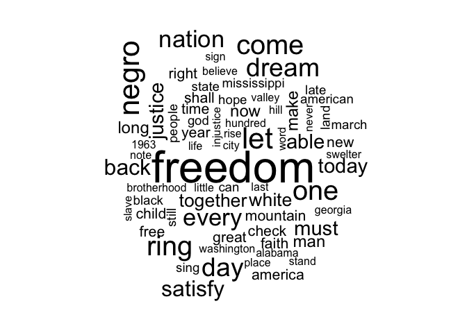
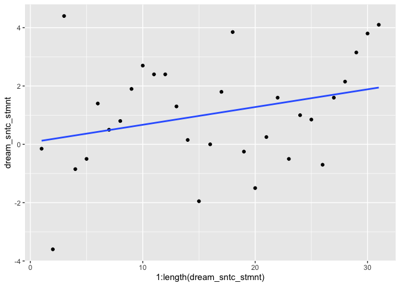
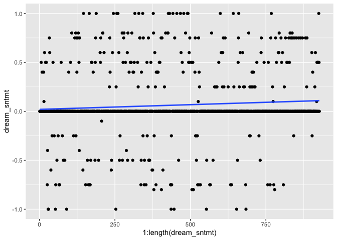
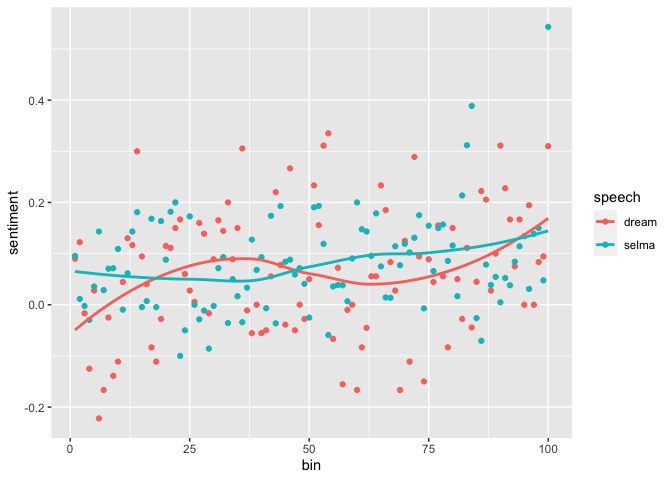
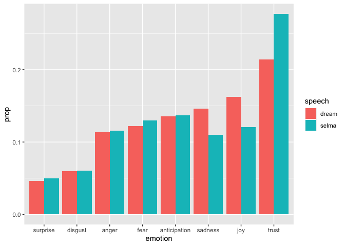
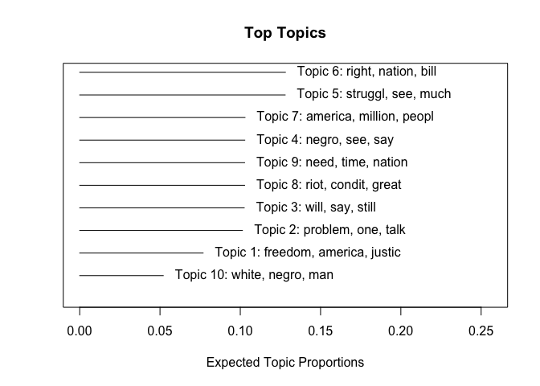
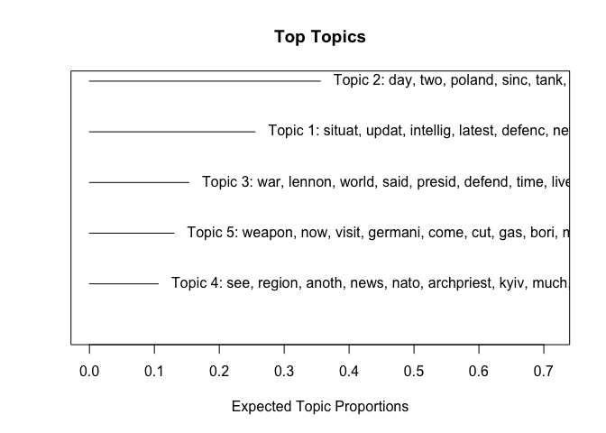

Text as Data (ECON/POLISCI 151, Week 3 Section)
================
Albert Chiu

## Text as Data

This week’s section will introduce some basic ideas and methods for
analyzing text as a type of data.

What do we want to learn?

-   Characterize a corpus of documents
    -   Overall tone/sentiment
    -   Topics discussed
-   Characterizing individual documents?

## Pre-Processing

We call any body of text (e.g., a tweet, a State of the Union Address,
an NGO charter) a *document*. Most literally, a document is just a
sequence of words and punctuation: {`Most`, `literally`, `,`, … }. For
us to analyze a document — just as with any type of data — we need to
identify the features that capture the most vital information. There is
single valid answer to this question, but today we will adopt the
following framework for pre-processing documents:

1.  Remove capitalization, punctuation, stop words
2.  Remove word order (bag-of-words model)
3.  Define equivalence classes (stem, lemmatization, and/or synonyms)
    -   Stemming/lemmatization: is \~ are \~ be \~ were

<!-- Synonym: angry ~ vexed ~ irate -->

-   (Other simplifications, depending on context)

The result is a *document-term matrix*
<!--$M\in\mathbb{R}^{N\times J}$: each row is a document, each column is a term, and corresponding entry $M_{nj}$ is number of times term $j$ appears in document $n$.-->

First, let’s define a function for step 1. This is the same function we
used in week 2’s Twitter example, except it folds in a step that removes
capitalization.

``` r
clean_text <- function(x) {
  x %>% tm::removeWords(stopwords::stopwords("en")) %>% 
    tm::stripWhitespace() %>%
    tm::removePunctuation() %>%
    tolower()
}
```

Let’s use MLK’s “I Have a Dream” speech as an example.

``` r
dream_url <- "https://www.npr.org/2010/01/18/122701268/i-have-a-dream-speech-in-its-entirety"
dream_speech <- rvest::read_html(dream_url) %>% 
  rvest::html_elements("p") %>%
  rvest::html_text() %>% 
  .[5:35]  # remove NPR's introduction/ending
# remove indicator of speaker
dream_speech[1] <- strsplit(dream_speech[1], ":")[[1]][2]

# before cleaning
head(dream_speech)
```

    ## [1] " Five score years ago, a great American, in whose symbolic shadow we stand today, signed the Emancipation Proclamation. This momentous decree came as a great beacon light of hope to millions of Negro slaves who had been seared in the flames of withering injustice. It came as a joyous daybreak to end the long night of their captivity."                                                                                                                                                                                                                                           
    ## [2] "But 100 years later, the Negro still is not free. One hundred years later, the life of the Negro is still sadly crippled by the manacles of segregation and the chains of discrimination. One hundred years later, the Negro lives on a lonely island of poverty in the midst of a vast ocean of material prosperity. One hundred years later the Negro is still languished in the corners of American society and finds himself in exile in his own land. And so we've come here today to dramatize a shameful condition. In a sense we've come to our nation's capital to cash a check. "
    ## [3] "When the architects of our republic wrote the magnificent words of the Constitution and the Declaration of Independence, they were signing a promissory note to which every American was to fall heir. This note was a promise that all men — yes, Black men as well as white men — would be guaranteed the unalienable rights of life, liberty and the pursuit of happiness."                                                                                                                                                                                                             
    ## [4] "It is obvious today that America has defaulted on this promissory note insofar as her citizens of color are concerned. Instead of honoring this sacred obligation, America has given the Negro people a bad check, a check which has come back marked insufficient funds."                                                                                                                                                                                                                                                                                                                 
    ## [5] "But we refuse to believe that the bank of justice is bankrupt."                                                                                                                                                                                                                                                                                                                                                                                                                                                                                                                            
    ## [6] "We refuse to believe that there are insufficient funds in the great vaults of opportunity of this nation. And so we've come to cash this check, a check that will give us upon demand the riches of freedom and the security of justice."

``` r
# after cleaning
dream_speech <- unname(sapply(dream_speech, clean_text))
head(dream_speech)
```

    ## [1] " five score years ago great american whose symbolic shadow stand today signed emancipation proclamation this momentous decree came great beacon light hope millions negro slaves seared flames withering injustice it came joyous daybreak end long night captivity"                                                                                                                                                  
    ## [2] "but 100 years later negro still free one hundred years later life negro still sadly crippled manacles segregation chains discrimination one hundred years later negro lives lonely island poverty midst vast ocean material prosperity one hundred years later negro still languished corners american society finds exile land and come today dramatize shameful condition in sense come nations capital cash check "
    ## [3] "when architects republic wrote magnificent words constitution declaration independence signing promissory note every american fall heir this note promise men — yes black men well white men — guaranteed unalienable rights life liberty pursuit happiness"                                                                                                                                                          
    ## [4] "it obvious today america defaulted promissory note insofar citizens color concerned instead honoring sacred obligation america given negro people bad check check come back marked insufficient funds"                                                                                                                                                                                                                
    ## [5] "but refuse believe bank justice bankrupt"                                                                                                                                                                                                                                                                                                                                                                             
    ## [6] "we refuse believe insufficient funds great vaults opportunity nation and come cash check check give us upon demand riches freedom security justice"

### *n*-grams and bag-of-words as a dimmensionality reduction technique

Now let’s implement our bag-of-words assumption:

``` r
dream_wrds <- unlist(strsplit(dream_speech, " +"))
sort(table(dream_wrds), decreasing = T)[1:10]
```

    ## dream_wrds
    ## freedom       i     let   negro     one    ring      we     day   dream    come 
    ##      21      14      13      13      12      12      12      11      11      10

Our assumptions are very strong, and sometimes they will not make sense
or will fail to capture the essence of a document; thus, validation will
be key. Word order clearly matters. Consider, for example, the following
phrases:

-   Peace, no more war
-   War, no more peace

Still, we can often learn a lot about documents even after these
simplifications. In this example, even if we knew nothing of MLK’s
famous speech, we could surmise that a core theme is the freedom (or
lack thereof) of black people.

<!--We will also briefly discuss the shortcomings of these assumptions and relax the bag-of-words assumption in particular.-->
<!--But the dimension of our data would grow exponentially if we retain word order. In a document with $J$ words, all of them distinct, there are $J!$ ways to arrange them. If there are 100 words, that's about 9e157, which is over a trillion-trillion, ways to arrange them. We _must_ at least partially discard word order to get any traction. 
-->

We can often at least slightly relax the bag-of-words assumption using
*n*-grams, which are sequences of words of length *n*. The bag-of-words
assumption effectively reduces a document to unigrams (1-grams). Let’s
see what the most popular bigrams and trigrams are for the “Dream”
speech:

``` r
dream_bigrams <- ngram::ngram(paste(dream_speech, collapse=" "), n=2)
head(ngram::get.phrasetable(dream_bigrams))
```

    ##            ngrams freq        prop
    ## 1   freedom ring    11 0.011904762
    ## 2    let freedom    10 0.010822511
    ## 3        i dream     8 0.008658009
    ## 4        one day     8 0.008658009
    ## 5        go back     7 0.007575758
    ## 6 satisfied long     5 0.005411255

``` r
dream_trigrams <- ngram::ngram(paste(dream_speech, collapse=" "), n=3)
head(ngram::get.phrasetable(dream_trigrams))
```

    ##                 ngrams freq        prop
    ## 1    let freedom ring    10 0.010834236
    ## 2       dream one day     5 0.005417118
    ## 3         i dream one     5 0.005417118
    ## 4     with faith able     3 0.003250271
    ## 5        we can never     3 0.003250271
    ## 6 can never satisfied     3 0.003250271

This gives us a richer picture of the speech, and the messaging becomes
clearer. Why don’t we always use bigrams, trigrams, or even longer
sequences? It goes back to the dimensionality issue. With this one
document, there are many repeated phrases, but this won’t always be the
case. It also often won’t be the case that *multiple* documents share
the *same* repeated phrases. Your matrix will be sparse, with most
phrases occuring very few times in very few documents, and you will need
to resort to another dimensionality reduction technique to get any
traction in your analysis.

### Stemming and Lemmatization

There are a number of stemming and lemmatization algorithms, most of
which . We’ll use the Snowball algorithm, Martin Porter’s extension of
his eponymous algorithm.

``` r
dream_stems <- SnowballC::wordStem(dream_wrds)
sort(table(dream_stems), decreasing = T)[1:10]
```

    ## dream_stems
    ## freedom   negro       i     let      on    ring      we     dai   dream    come 
    ##      21      15      14      13      12      12      12      11      11      10

You can also try other libraries, often with similar results:

``` r
dream_lemmas <- textstem::lemmatize_words(dream_wrds)
sort(table(dream_lemmas), decreasing = T)[1:10]
```

    ## dream_lemmas
    ## freedom       i     let   negro    come     one    ring      we     day   dream 
    ##      21      14      13      13      12      12      12      12      11      11

``` r
wordcloud::wordcloud(dream_lemmas)
```

    ## Warning in tm_map.SimpleCorpus(corpus, tm::removePunctuation): transformation
    ## drops documents

    ## Warning in tm_map.SimpleCorpus(corpus, function(x) tm::removeWords(x,
    ## tm::stopwords())): transformation drops documents

<!-- -->

See
[here](https://cran.r-project.org/web/views/NaturalLanguageProcessing.html)
for a list of packages.

## Sentiment Analysis

``` r
# scores for each word
dream_sntmt <- syuzhet::get_sentiment(dream_lemmas, method = "syuzhet")
head(dream_sntmt)
```

    ## [1] 0.0 0.0 0.0 0.0 0.0 0.5

``` r
# average score of words
mean(dream_sntmt)  # overall positive test
```

    ## [1] 0.06456311

``` r
# plot sentiment of sentences through speech
dream_sntc_stmnt <- syuzhet::get_sentiment(dream_speech, method="syuzhet") 
ggplot2::ggplot(mapping=ggplot2::aes(x=1:length(dream_sntc_stmnt), y=dream_sntc_stmnt))+
  ggplot2::geom_point()+
  ggplot2::geom_smooth(method="lm", se=F)  # positive trajectory?
```

    ## `geom_smooth()` using formula 'y ~ x'

<!-- -->

``` r
# you can also make this plot for words, but will be noisy
ggplot2::ggplot(mapping=ggplot2::aes(x=1:length(dream_sntmt), y=dream_sntmt))+
  ggplot2::geom_point()+
  ggplot2::geom_smooth(method="lm", se=F)  # positive trajectory?
```

    ## `geom_smooth()` using formula 'y ~ x'

<!-- -->

Comparing sentiment of two texts:

``` r
selma_url <-"https://kinginstitute.stanford.edu/our-god-marching"
selma_full <- rvest::read_html(selma_url) %>%
  rvest::html_elements("p") %>%
  rvest::html_text() %>% 
  .[3:74] 
selma_speech <- clean_text(selma_full)

selma_lemmas <- selma_speech %>% 
  strsplit(split=" +") %>% 
  unlist() %>% 
  textstem::lemmatize_words()
selma_sntmt <- syuzhet::get_sentiment(selma_lemmas, method = "syuzhet")
mean(selma_sntmt)
```

    ## [1] 0.08051044

``` r
# compare trajectories
dream_binned <- syuzhet::get_percentage_values(dream_sntmt)
selma_binned <- syuzhet::get_percentage_values(selma_sntmt)
print(c("dream"=sum(dream_binned), "selma"=sum(selma_binned)))
```

    ##    dream    selma 
    ## 6.410556 8.034632

``` r
sntmts <- rbind(cbind.data.frame(bin=1:100, sentiment = dream_binned, speech="dream"),
                cbind.data.frame(bin=1:100, sentiment = selma_binned, speech="selma"))

ggplot2::ggplot(data=sntmts, mapping=ggplot2::aes(x=bin, y=sentiment, color=speech))+
  ggplot2::geom_point()+
  ggplot2::geom_smooth(se=F)  # positive trajectory?
```

    ## `geom_smooth()` using method = 'loess' and formula 'y ~ x'

<!-- -->

Beyond positive/negative [words sorted by eight
emotions](http://saifmohammad.com/WebPages/NRC-Emotion-Lexicon.htm)

``` r
dream_nrc <- syuzhet::get_nrc_sentiment(dream_speech)
selma_nrc <- syuzhet::get_nrc_sentiment(selma_speech)

dream_tab <- colSums(prop.table(dream_nrc[, 1:8]))
selma_tab <- colSums(prop.table(selma_nrc[, 1:8]))

emotion_labs <- names(selma_tab)

emtns <- rbind(cbind.data.frame(emotion = emotion_labs,
                                prop = dream_tab,
                                speech="dream"),
               cbind.data.frame(emotion = emotion_labs,
                                prop=selma_tab,
                                speech="selma"))

# display in order for dream speech
emtns$emotion <- factor(emtns$emotion, levels=emotion_labs[order(dream_tab)])

ggplot2::ggplot(data=emtns, mapping=ggplot2::aes(x=emotion, y=prop, fill=speech))+
  ggplot2::geom_bar(stat="identity", position="dodge")
```

<!-- -->

``` r
# trust
head(selma_speech[which(selma_nrc$trust > 0)])
```

    ## [1] "my dear abiding friends ralph abernathy distinguished americans seated rostrum friends coworkers state alabama freedomloving people assembled afternoon nation world last sunday eight thousand us started mighty walk selma alabama we walked desolate valleys across trying hills we walked meandering highways rested bodies rocky byways some faces burned outpourings sweltering sun some literally slept mud we drenched rains audience speak our bodies tired feet somewhat sore"                                                                                                                                 
    ## [2] "but today i stand think back great march i can say sister pollard said— seventyyearold negro woman lived community bus boycott— one day asked walking didn’t want ride and answered no person said well aren’t tired and ungrammatical profundity said my feets tired soul rested yes sir all right and real sense afternoon can say feet tired yes sir souls rested"                                                                                                                                                                                                                                                    
    ## [3] "they told us wouldn’t get  and said get dead bodies well yes sir talk world today knows standing forces power state alabama saying we ain’t goin’ let nobody turn us around yes sir speak applause"                                                                                                                                                                                                                                                                                                                                                                                                                      
    ## [4] "now accident one great marches american history terminate montgomery alabama yes sir just ten years ago city new philosophy born negro struggle montgomery first city south entire negro community united squarely faced ageold oppressors yes sir well out struggle bus desegregation won new idea powerful guns clubs born negroes took carried across south epic battles yes sir speak electrified nation well world"                                                                                                                                                                                                 
    ## [5] "yet strangely climactic conflicts always fought won alabama soil after montgomery’s heroic confrontations loomed mississippi arkansas georgia elsewhere but colossus segregation challenged birmingham conscience america begin bleed white america profoundly aroused birmingham witnessed whole community negroes facing terror brutality majestic scorn heroic courage and wells democratic spirit nation finally forced congress well write legislation yes sir hope eradicate stain birmingham the civil rights act 1964 gave negroes part rightful dignity speak sir without vote dignity without strength yes sir"
    ## [6] "once method nonviolent resistance yes unsheathed scabbard entire community mobilized confront adversary yes sir and brutality dying order shrieks across land yet selma alabama became shining moment conscience man if worst american life lurked dark streets best american instincts arose passionately across nation overcome  yes sir speak there never moment american history yes sir honorable inspiring pilgrimage clergymen laymen every race faith pouring selma face danger yes side embattled negroes"

## Topic Models

What topics do the documents discuss?

``` r
other_url <- "https://www.rev.com/blog/transcripts/the-other-america-speech-transcript-martin-luther-king-jr"
other <- rvest::read_html(other_url) %>% 
  rvest::html_elements("p") %>% 
  rvest::html_text() %>% 
  .[6:44] %>% 
  sapply(function(x) strsplit(x, "\n")[[1]][2]) %>%
  unname() 
other_proc <- stm::textProcessor(other)
```

    ## Building corpus... 
    ## Converting to Lower Case... 
    ## Removing punctuation... 
    ## Removing stopwords... 
    ## Removing numbers... 
    ## Stemming... 
    ## Creating Output...

``` r
set.seed(123)
stm_out <- stm::stm(other_proc$documents, other_proc$vocab, K = 10, 
                    data = other_proc$meta, verbose = F)

# top documents for a select few topics
other_short <- sapply(other, function(x) paste(strsplit(x, " +")[[1]][1:10], collapse=" ") )
stm::findThoughts(stm_out, texts=unname(other_short), n=3)
```

    ## 
    ##  Topic 1: 
    ##       And I am still convinced that there are still many
    ##      What I’m trying to get across is that our nation
    ##      And this is why Frederick Douglass could say that emancipation 
    ##  Topic 2: 
    ##       Now, in order to develop these massive action programs, we’ve
    ##      Mr. Bell, and members of the faculty and members of
    ##      Now, let me go on to say that, if we 
    ##  Topic 3: 
    ##       I say that if the inexpressible cruelties of slavery couldn’t
    ##      With this faith, we will be able to speed up
    ##      Now, let me say, finally, that we have difficult days 
    ##  Topic 4: 
    ##       And as we look at these problems, we see them
    ##      And so we must do certain things for ourselves, but
    ##      I went on to remind him the Negro came to 
    ##  Topic 5: 
    ##       And so today, we are struggling for something which says
    ##      Now, let me say that the struggle for our civil
    ##      Now the other thing that we’ve got to come to 
    ##  Topic 6: 
    ##       And so I realize that if we are to have
    ##      Now, I said I wasn’t going to talk about Vietnam,
    ##      This leads me to say something about another discussion that 
    ##  Topic 7: 
    ##       In a sense, the greatest tragedy of this other America
    ##      And I’d like to use as a subject from which
    ##      But tragically and unfortunately, there is another America. This other 
    ##  Topic 8: 
    ##       But at the same time, it is as necessary for
    ##      Now, there’s another thing that I’d like to mention, as
    ##      And the struggle was to deal with these problems. Certainly, 
    ##  Topic 9: 
    ##       Now, nobody can doubt the need for this. Nobody can
    ##      I think there is an answer to that myth, and
    ##      Now, there’s another notion that gets out. It’s around everywhere. 
    ##  Topic 10: 
    ##       And so there can be no separate black path to
    ##      Let me say another thing that’s more in the realm
    ##      Is to deal with this problem, to deal with this

``` r
stm::plot.STM(stm_out)
```

<!-- -->

``` r
twts <- rtweet::search_tweets(q="ukraine", n=500, lang="en")

twts_proc <- stm::textProcessor(twts$text)
```

    ## Building corpus... 
    ## Converting to Lower Case... 
    ## Removing punctuation... 
    ## Removing stopwords... 
    ## Removing numbers... 
    ## Stemming... 
    ## Creating Output...

``` r
stm_twts <- stm::stm(twts_proc$documents, twts_proc$vocab, K = 5, max.em.its = 75,
                     data = twts_proc$meta, verbose = F)

stm::plot.STM(stm_twts, n = 10)
```

<!-- -->
