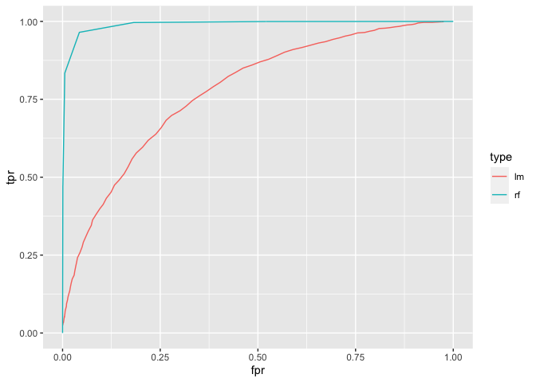
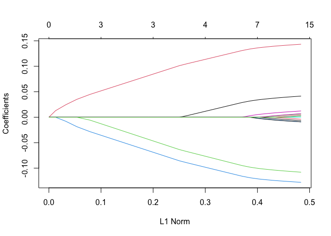
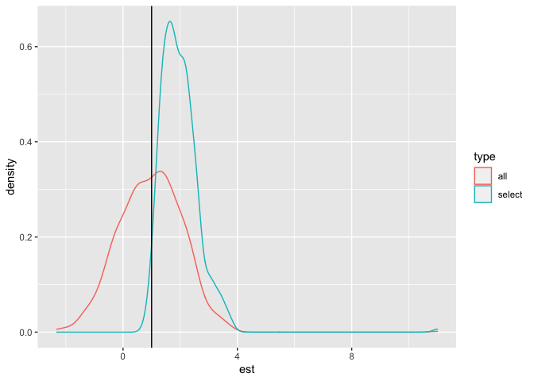

Model Selection and Selective Inference (ECON/POLISCI 151, Week 3
Section)
================
Albert Chiu

## Model Selection

Last week’s lectures introduced the broad topics of machine learning and
causal inference. For any given task under either umbrella, there are
potentially many models to choose from. There are several considerations
you might face:

-   Which method to use (e.g., OLS, logistic regression, LASSO)
-   Which variables to include
-   Parameter tuning (e.g., the penalty parameter in the LASSO)

### What does it mean to be “better?”

When is one model “better” than another? A loss function is an objective
way of measuring how “good” a model is. The basic idea is to penalize
your model for its errors. Some notable examples are the 0-1 loss (for
classification only) and the quadratic loss. Intuitively, then, you may
think of selecting the model that minimizes loss — or, more generally,
some criterion — but on which data?

### What data do we use?

#### In-sample (training data)

``` r
# data generating process (DGP)
set.seed(123)
n <- 10000; p <- 5
n_train <- n/2
X <- rnorm(n*p) %>% matrix(nrow=n)
beta <- rnorm(p)
beta[5] <- 0
mu <- plogis(X %*% beta + rnorm(n)) 
Y <- rbinom(n, size=1, prob=mu)

df <- cbind.data.frame(Y, X)
colnames(df) <- c("Y", "X1", "X2", "X3", "X4", "X5")

train <- sample(n, n_train)

# Linear probability model
fit_models <- function(df, ind) {
  list(lpm_1 = lm(Y ~ ., data=df, subset = ind),
       lpm_2 = lm(Y ~ X1 + X2 + X3 + X4, data=df, subset = ind))
}

out <- fit_models(df=df, ind=train)

# compare in sample MSE
sum(out[[1]]$residuals^2)  # a tiny bit better
```

    ## [1] 998.5278

``` r
sum(out[[2]]$residuals^2)
```

    ## [1] 998.5798

#### Validation set

``` r
get_loss <- function(models, df, Y, ind) {
  return(c(sum( (predict(models[[1]], newdata = df[ind, ]) - Y[ind])^2 ),
           sum( (predict(models[[2]], newdata = df[ind, ]) - Y[ind])^2 )))
}

# compare in sample MSE
get_loss(models=out, df=df, Y=Y, ind=-train)  # model 2 slightly better
```

    ## [1] 970.1844 970.0071

#### -folds cross-validation

Interesting paper <a href="https://arxiv.org/pdf/2104.00673.pdf"> on
what cross validation is actually estimating</a>.

``` r
## caret package
folds <- caret::createFolds(y=Y, k=10)
lapply(folds[1:3], head)
```

    ## $Fold01
    ## [1]  12  23  68  76  78 111
    ## 
    ## $Fold02
    ## [1] 18 21 33 34 49 51
    ## 
    ## $Fold03
    ## [1] 10 16 27 38 57 60

``` r
## do it ourselves
gen_folds <- function(n, k) {
  pt <- gtools::permute(1:n)
  lapply(0:(k-1), FUN=function(x) pt[ ( x*round(n/k) + 1 ):( (x+1)*round(n/k) ) ] )
}

# example
head(gen_folds(20, 3))
```

    ## [[1]]
    ## [1]  8  7 16  9 17 10  1
    ## 
    ## [[2]]
    ## [1]  5 13  2  3 18 11 15
    ## 
    ## [[3]]
    ## [1]  6 19 12 14  4 20 NA

``` r
set.seed(123)
folds <- gen_folds(n=n, k=10)
```

``` r
## CV error
cv_errors <- c()
for (i in 1:10) {
  ## fit on all but one fold
  out_cv <- fit_models(df=df, ind=-folds[[i]])
  
  # evaluate on hold-out fold
  cv_errors <- rbind(cv_errors, get_loss(models=out_cv, df=df, Y=Y, ind=folds[[i]]))
}

# avg
apply(cv_errors, MARGIN=2, mean)
```

    ## [1] 197.0569 197.0342

### Classification

#### Confusion matrix

``` r
## compare with random forest
set.seed(123)
out_rf <- randomForest::randomForest(x=X, y=factor(Y), subset = train, ntree=5)

##
get_yhat <- function(model, df, ind, cutoff, rf=F) {
  if (rf) {
    p <- predict(model, newdata=df[ind, ], type="prob")[, "1"]
  } else {
    p <- predict(model, newdata=df[ind, ], type="response") 
  }
  return(ifelse(p >= cutoff, yes=1, no=0))
}

## predict 1 if p>=.5
yhat_lm <- get_yhat(out[[1]], df, -train, .5)
yhat_rf <- get_yhat(out_rf, X, -train, .5, rf=T)

caret::confusionMatrix(factor(yhat_lm), factor(Y[-train]))
```

    ## Confusion Matrix and Statistics
    ## 
    ##           Reference
    ## Prediction    0    1
    ##          0 1776  766
    ##          1  687 1771
    ##                                          
    ##                Accuracy : 0.7094         
    ##                  95% CI : (0.6966, 0.722)
    ##     No Information Rate : 0.5074         
    ##     P-Value [Acc > NIR] : < 2e-16        
    ##                                          
    ##                   Kappa : 0.4189         
    ##                                          
    ##  Mcnemar's Test P-Value : 0.04073        
    ##                                          
    ##             Sensitivity : 0.7211         
    ##             Specificity : 0.6981         
    ##          Pos Pred Value : 0.6987         
    ##          Neg Pred Value : 0.7205         
    ##              Prevalence : 0.4926         
    ##          Detection Rate : 0.3552         
    ##    Detection Prevalence : 0.5084         
    ##       Balanced Accuracy : 0.7096         
    ##                                          
    ##        'Positive' Class : 0              
    ## 

``` r
caret::confusionMatrix(factor(yhat_rf), factor(Y[-train]))
```

    ## Confusion Matrix and Statistics
    ## 
    ##           Reference
    ## Prediction    0    1
    ##          0 2357   89
    ##          1  106 2448
    ##                                           
    ##                Accuracy : 0.961           
    ##                  95% CI : (0.9553, 0.9662)
    ##     No Information Rate : 0.5074          
    ##     P-Value [Acc > NIR] : <2e-16          
    ##                                           
    ##                   Kappa : 0.922           
    ##                                           
    ##  Mcnemar's Test P-Value : 0.2519          
    ##                                           
    ##             Sensitivity : 0.9570          
    ##             Specificity : 0.9649          
    ##          Pos Pred Value : 0.9636          
    ##          Neg Pred Value : 0.9585          
    ##              Prevalence : 0.4926          
    ##          Detection Rate : 0.4714          
    ##    Detection Prevalence : 0.4892          
    ##       Balanced Accuracy : 0.9609          
    ##                                           
    ##        'Positive' Class : 0               
    ## 

``` r
# formulas for some of the things you can compute using this table:
#?caret::confusionMatrix
```

#### Receiver operating characteristic (ROC) curve & Area under the curve (AUC)

``` r
get_tprfpr <- function(yhat, y) {
  return(c("tpr"=sum(yhat==1 & y==1)/sum(y==1), 
           "fpr"=sum(yhat==1 & y==0)/sum(y==0)))
}

stats_lm <- c(); stats_rf <- c();
for (i in 0:101) {
  cutoff <- i/100
  
  yhat_lm <- get_yhat(out[[1]], df=df, ind = -train, cutoff = cutoff)
  yhat_rf <- get_yhat(out_rf, df=X, ind = -train, cutoff = cutoff, rf=T)

  stats_lm <- rbind.data.frame(stats_lm, get_tprfpr(yhat_lm, y=Y[-train]))
  stats_rf <- rbind.data.frame(stats_rf, get_tprfpr(yhat_rf, y=Y[-train]))
}
colnames(stats_lm) <- c("tpr", "fpr"); colnames(stats_rf) <- c("tpr", "fpr")

require(ggplot2)
```

    ## Loading required package: ggplot2

``` r
pdf <- rbind.data.frame(cbind.data.frame(stats_lm, "type"="lm"),
                        cbind.data.frame(stats_rf, "type"="rf"))
ggplot(data=pdf, mapping=aes(x=fpr, y=tpr, color=type))+
  geom_line()
```

<!-- -->

``` r
DescTools::AUC(x=stats_lm[, "fpr"], y=stats_lm[, "tpr"])
```

    ## Warning in regularize.values(x, y, ties, missing(ties), na.rm = na.rm):
    ## collapsing to unique 'x' values

    ## [1] 0.7529304

``` r
DescTools::AUC(x=stats_rf[, "fpr"], y=stats_rf[, "tpr"]) 
```

    ## Warning in regularize.values(x, y, ties, missing(ties), na.rm = na.rm):
    ## collapsing to unique 'x' values

    ## [1] 0.9904931

``` r
# only 5 trees, only 5 outcomes
unique(predict(out_rf, newdata=X[-train, ], type="prob")[, "1"]) %>% sort
```

    ## [1] 0.0 0.2 0.4 0.6 0.8 1.0

#### Brier score

``` r
pred_prob_lm <- predict(out[[1]], newdata = df[-train, ])
pred_prob_rf <- predict(out_rf, newdata = X[-train, ], type="prob")[, 2]

sum( (Y[-train]-pred_prob_lm)^2 )
```

    ## [1] 970.1844

``` r
sum( (Y[-train]-pred_prob_rf)^2 )
```

    ## [1] 255.6

### Regression

#### Coefficient of determination (“”)

``` r
# R^2 necessarily is non-increasing w/ number of variables
lapply(out, function(x) summary(x)$r.squared)
```

    ## $lpm_1
    ## [1] 0.2007326
    ## 
    ## $lpm_2
    ## [1] 0.200691

``` r
# adjust for this
lapply(out, function(x) summary(x)$adj.r.squared)
```

    ## $lpm_1
    ## [1] 0.1999324
    ## 
    ## $lpm_2
    ## [1] 0.2000509

#### Akaike Information Criterion (AIC) and Bayesian Information Criterion (BIC)

``` r
lapply(out, AIC)
```

    ## $lpm_1
    ## [1] 6148.829
    ## 
    ## $lpm_2
    ## [1] 6147.09

``` r
out_lgst <- glm(Y~., family="binomial", data=df, subset=train)
AIC(out[[1]], out[[2]], out_lgst)
```

    ##          df      AIC
    ## out[[1]]  7 6148.829
    ## out[[2]]  6 6147.090
    ## out_lgst  6 5818.411

``` r
BIC(out[[1]], out[[2]], out_lgst)
```

    ##          df      BIC
    ## out[[1]]  7 6194.450
    ## out[[2]]  6 6186.193
    ## out_lgst  6 5857.514

### Methods for selecting a model

#### Covariate selection

##### Step-wise and best subset

``` r
MASS::stepAIC(out_lgst, direction = "both")
```

    ## Start:  AIC=5818.41
    ## Y ~ X1 + X2 + X3 + X4 + X5
    ## 
    ##        Df Deviance    AIC
    ## - X5    1   5806.6 5816.6
    ## <none>      5806.4 5818.4
    ## - X1    1   5851.4 5861.4
    ## - X3    1   6092.8 6102.8
    ## - X4    1   6205.1 6215.1
    ## - X2    1   6295.3 6305.3
    ## 
    ## Step:  AIC=5816.62
    ## Y ~ X1 + X2 + X3 + X4
    ## 
    ##        Df Deviance    AIC
    ## <none>      5806.6 5816.6
    ## + X5    1   5806.4 5818.4
    ## - X1    1   5851.6 5859.6
    ## - X3    1   6092.9 6100.9
    ## - X4    1   6205.2 6213.2
    ## - X2    1   6295.6 6303.6

    ## 
    ## Call:  glm(formula = Y ~ X1 + X2 + X3 + X4, family = "binomial", data = df, 
    ##     subset = train)
    ## 
    ## Coefficients:
    ## (Intercept)           X1           X2           X3           X4  
    ##    -0.03724      0.21063      0.72269     -0.54652     -0.64947  
    ## 
    ## Degrees of Freedom: 4999 Total (i.e. Null);  4995 Residual
    ## Null Deviance:       6929 
    ## Residual Deviance: 5807  AIC: 5817

``` r
out_subs <- leaps::regsubsets(x=X, y=Y, method="exhaustive")
summary(out_subs)  # best models of different complexities
```

    ## Subset selection object
    ## 5 Variables  (and intercept)
    ##   Forced in Forced out
    ## a     FALSE      FALSE
    ## b     FALSE      FALSE
    ## c     FALSE      FALSE
    ## d     FALSE      FALSE
    ## e     FALSE      FALSE
    ## 1 subsets of each size up to 5
    ## Selection Algorithm: exhaustive
    ##          a   b   c   d   e  
    ## 1  ( 1 ) " " "*" " " " " " "
    ## 2  ( 1 ) " " "*" " " "*" " "
    ## 3  ( 1 ) " " "*" "*" "*" " "
    ## 4  ( 1 ) "*" "*" "*" "*" " "
    ## 5  ( 1 ) "*" "*" "*" "*" "*"

##### LASSO

``` r
X_hd <- cbind(X, matrix(rnorm(n*10), nrow=n))
head(X_hd)
```

    ##             [,1]       [,2]       [,3]        [,4]        [,5]       [,6]
    ## [1,] -0.56047565  2.3707252 -0.8362967 -0.19360641  0.48252737 -0.6150893
    ## [2,] -0.23017749 -0.1668120 -0.2205730  0.25814728  0.72136466  0.6298134
    ## [3,]  1.55870831  0.9269614 -2.1035148 -0.53831257 -0.50779230 -1.1703471
    ## [4,]  0.07050839 -0.5681517 -1.6678075 -1.17906281 -0.06470875 -1.8348451
    ## [5,]  0.12928774  0.2250901 -1.0979629  0.90064742  1.30212117  1.3645821
    ## [6,]  1.71506499  1.1319859 -1.6656212 -0.01624955 -0.21863687 -1.1296803
    ##            [,7]        [,8]       [,9]      [,10]       [,11]       [,12]
    ## [1,]  0.2174376  0.61806021 -0.8504684 -0.6275021  0.16489889  0.67729009
    ## [2,]  0.8329416 -0.62846405 -0.1711832  1.9966757  0.58081470 -0.54639324
    ## [3,]  0.5752400 -0.04880704 -0.9038030 -1.0921612 -2.04055170  0.89587154
    ## [4,]  1.7312190  1.48586481  0.4234343  0.1013481  1.20593695 -0.29992864
    ## [5,]  0.3931485 -1.09666571 -0.1355237 -0.5803259  0.08428762 -0.05782007
    ## [6,] -0.1162537  0.14261227 -1.4594067 -1.5728365  0.07414819 -0.33124616
    ##           [,13]      [,14]       [,15]
    ## [1,] -1.7259244  0.6858968 -0.05862686
    ## [2,]  0.1726622 -0.4613883 -0.42233944
    ## [3,]  0.3909007 -0.5839419  0.21270043
    ## [4,]  1.7793884 -0.6071011 -0.80610614
    ## [5,] -2.2030335 -1.5188338  0.16053288
    ## [6,]  0.6589677  0.6093587 -0.26900612

``` r
### sequence of potential lambdas
out_lasso <- glmnet::glmnet(X_hd[train, ], Y[train], alpha=1)
plot(out_lasso)
```

<!-- -->
#### Parameter tuning

##### Linear search

``` r
### pick lambda using CV
set.seed(123)
glmnet::cv.glmnet(X_hd[train, ], Y[train], alpha=1) %>%
  coef(s = .$lambda.min)
```

    ## 16 x 1 sparse Matrix of class "dgCMatrix"
    ##                        s1
    ## (Intercept)  4.917296e-01
    ## V1           3.887678e-02
    ## V2           1.408320e-01
    ## V3          -1.052407e-01
    ## V4          -1.254315e-01
    ## V5           3.737795e-05
    ## V6           9.842490e-03
    ## V7          -4.118141e-03
    ## V8           1.618728e-03
    ## V9           3.735178e-03
    ## V10         -6.501406e-03
    ## V11          .           
    ## V12          4.341660e-03
    ## V13         -6.808465e-03
    ## V14         -1.336572e-03
    ## V15          .

##### Grid search

``` r
### pick lambda AND alpha using CV
## fix the folds that we will use for each value of alpha
set.seed(123)
fold_id <- sample(rep(seq(10), length = n))  # another way of creating folds

## go through values of alpha
min_mses <- c(); min_lambdas <- c()
alphas <- seq(from=0, to=1, by=.05)
for (alpha in alphas) {
  out_grid <- glmnet::cv.glmnet(X_hd, Y, foldid = fold_id, alpha=alpha)
  min_mses <- c(min_mses, min(out_grid$cvm))
  min_lambdas <- c(min_lambdas, out_grid$lambda.min)
}

cbind(alphas, min_lambdas)[which.min(min_mses), ]
```

    ##      alphas min_lambdas 
    ## 1.000000000 0.002991077

## Selective Inference

#### Inference after variable selection

``` r
## conditioning on selection by lasso distorts sampling dist
selected <- c(); cis <- c(); coefs <- c()
n_new <- 100 
X_new <- X[1:n_new, 1]  # just one variable, and just n_new observations
set.seed(123)
for ( i in 1:1000 ) {
  # draw new sample from same dgp each time
  Y_new <- X_new + rnorm(n_new, sd=10)  # beta=1
  df_new <- cbind.data.frame(Y_new, X_new)
  
  selected <- c(selected, 
                (glmnet::cv.glmnet(cbind(1,  # only include intercept
                                         X_new), Y_new, alpha=1) %>% 
                 coef(s=.$lambda.min) %>%
                 as.numeric())[3] > 0)
  out <- lm(Y_new ~ X_new)
  cis <- rbind(cis, confint(out)[2, ])
  coefs <- c(coefs, coef(out)[2])
}
```

    ## Warning in summary.lm(object, ...): essentially perfect fit: summary may be
    ## unreliable

``` r
pdf <- rbind.data.frame(cbind.data.frame("est"=coefs, type="all"),
                        cbind.data.frame("est"=coefs[selected], type="select"))
require(ggplot2)
ggplot(data=pdf)+
  geom_density(aes(x=est, color=type))+
  geom_vline(aes(xintercept=1))
```

<!-- -->

#### Post selection inference (PoSI)

Valid for any method of selection — you can throw darts at a board to
pick your variables if you wanted. Confidence intervals are valid for
*any* sub-model.

``` r
# PoSI
posi <- PoSI::PoSI(X = X)
```

    ## Number of contrasts/adjusted predictors to process: 80 
    ## Number of bundles: 5 
    ##                          Done with bundle 1 / 5    model sz = 1 
    ##                          Done with bundle 2 / 5    model sz = 2 
    ##                          Done with bundle 3 / 5    model sz = 3 
    ##                          Done with bundle 4 / 5    model sz = 4 
    ##                          Done with bundle 5 / 5    model sz = 5 
    ## p = 5 , d = 5   processed 80 tests in 31 models.  Times in seconds:
    ##    user  system elapsed 
    ##   0.024   0.001   0.024

``` r
summary(posi)
```

    ##     K.PoSI K.Bonferroni K.Scheffe
    ## 95%  2.575        3.421     3.327
    ## 99%  3.094        3.836     3.884

``` r
K <- summary(posi)[1, 1]

# confidence interval = [beta - K*SE(beta), beta + K*SE(beta)] 
```

#### Selection with the LASSO

If you’re willing to commit to a specific method of selection, we can
sometimes get more traction. E.g.,
<a href="https://arxiv.org/pdf/1311.6238.pdf">selection using the
LASSO</a>.

#### Also interesting

-   Especially for causal inference:
    <a href="https://academic.oup.com/restud/article/81/2/608/1523757?login=true">double
    selection using the LASSO</a>.
-   Rank verification:
    <a href="https://projecteuclid.org/journals/annals-of-statistics/volume-47/issue-2/Rank-verification-for-exponential-families/10.1214/17-AOS1634.full">Who’s
    the winner?</a>.

### A Brief Intro to Multiple Testing

#### The multiple testing problem

``` r
n <- 3000
p <- 500
alpha <- .2
set.seed(123)
X <- matrix(rnorm(n=n*p, mean=0, sd=1/sqrt(n)), ncol=p)
X <- apply(X, MARGIN=2, FUN=function(x) x/sum(x)) # standardize columns
beta <- c(rep(3.5, times=35), rep(0, times=p-35))
y <- X%*%beta + rnorm(n=n)

## the multiple testing problem
out <- summary(lm(y~X))
# true discoveries
trd <- sum(out$coefficients[1:34, 4] < alpha)
# false discoveries
fd <- sum(out$coefficients[36:p, 4] < alpha)

# false discovery rate = #{false discoveries}/#{total discoveries}
fd/(trd+fd)  # the majority of our "discoveries" are false
```

    ## [1] 0.7368421

#### Benjamini-Hocheberg

``` r
require(sgof)
```

    ## Loading required package: sgof

    ## Loading required package: poibin

``` r
out_BH <- BH(out$coefficients[, 4])
out_BH$Rejections  # rejects the first 27 p-values
```

    ## [1] 27

``` r
head(out_BH$Adjusted.pvalues)
```

    ## [1]  0.000000e+00  0.000000e+00  0.000000e+00  0.000000e+00 5.348396e-234
    ## [6] 4.402935e-154

#### Knock-offs

``` r
require(knockoff)
```

    ## Loading required package: knockoff

``` r
# functions
create_W <- function(X, Xtilde, y) stat.glmnet_coefdiff(X, Xtilde, y,
                                                        glmnet.lambda=c(1.6))
create_Xtilde_sdp <- function(X) create.fixed(X=X, method="sdp")
create_Xtilde_equi <- function(X) create.fixed(X=X, method="equi")

out_knockoff <- knockoff.filter(X=X, y=y, knockoffs = create_Xtilde_equi,
                                   statistic = create_W, fdr = alpha, 
                                   offset = 1)
```

    ## Loading required package: Matrix

    ## Loaded glmnet 4.1-3

``` r
length(out_knockoff$selected)
```

    ## [1] 38

#### A Simulation

``` r
# simulation
if(FALSE){  # takes a long time to run; don't run when compiling pdf
knockoff_V <- c(); knockoff_R <- c(); knockoff_p_V <- c(); 
knockoff_p_R <- c(); bh_V <- c(); bh_R <- c()
set.seed(123)
X <- matrix(rnorm(n=n*p, mean=0, sd=1/sqrt(n)), ncol=p)
X <- apply(X, MARGIN=2, FUN=function(x) x/sum(x))  # standardize columns
beta <- c(rep(3.5, times=35), rep(0, times=p-35))
for(t in 1:100){
  print(t)
  # create data
  y <- X%*%beta + rnorm(n=n)  # standard normal errors
  
  # knockoffs
  # equi-correlated is faster
  #reject_sdp <- knockoff.filter(X=X, y=y, knockoffs = create_Xtilde_sdp, 
  #                              statistic = create_W, fdr = alpha, offset = 0)$selected
  #reject_sdp_p <- knockoff.filter(X=X, y=y, knockoffs = create_Xtilde_sdp, 
  #                                statistic = create_W, fdr = alpha,offset = 1)$selected
  reject_equi <- knockoff.filter(X=X, y=y, knockoffs = create_Xtilde_equi, 
                                 statistic = create_W, fdr = alpha, 
                                 offset = 0)$selected
  reject_equi_p <- knockoff.filter(X=X, y=y, knockoffs = create_Xtilde_equi,
                                   statistic = create_W, fdr = alpha, 
                                   offset = 1)$selected
  # BH
  pvals <- summary(lm(y~X))$coefficients[-1, 4]
  reject_bh <- which(order(pvals) %in% 
                       1:BH(pvals, alpha)$Rejections)  # indices of rejected
  bh_V[t] <- sum(reject_bh > 35) 
  bh_R[t] <- length(reject_bh)
  
  # rejections
  knockoff_V[t] <- sum(reject_equi > 35)  # betas after 35 are null
  knockoff_R[t] <- length(reject_equi)
  knockoff_p_V[t] <- sum(reject_equi_p > 35)  # betas after 35 are null
  knockoff_p_R[t] <- length(reject_equi_p)
  
}
save(knockoff_V, knockoff_R, knockoff_p_V, 
     knockoff_p_R, bh_V, bh_R, file="knockoff_sim.rda")
}

load("knockoff_sim.rda")
## FDR
# all roughly control FDR
rbind(c("knockoffs", "knockoffs+", "BHq"),
      c(mean(knockoff_V/knockoff_R),  # knockoffs
        mean(knockoff_p_V/knockoff_p_R),  # knockoffs+
        mean(bh_V/bh_R))  # BHq
)
```

    ##      [,1]                [,2]                [,3]               
    ## [1,] "knockoffs"         "knockoffs+"        "BHq"              
    ## [2,] "0.226767410023885" "0.196691380814167" "0.219152697591493"

``` r
## power
# knockoffs more powerful
rbind(c("knockoffs", "knockoffs+", "BHq"),
      # total rejections - false rejections = true rejections
      c(mean((knockoff_R-knockoff_V)/35),  # knockoffs
        mean((knockoff_p_R-knockoff_p_V)/35),  # knockoffs+
        mean((bh_R-bh_V)/35))  # BHq
)
```

    ##      [,1]                [,2]         [,3]               
    ## [1,] "knockoffs"         "knockoffs+" "BHq"              
    ## [2,] "0.839428571428571" "0.83"       "0.786857142857143"
